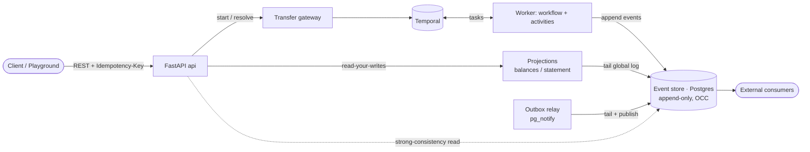
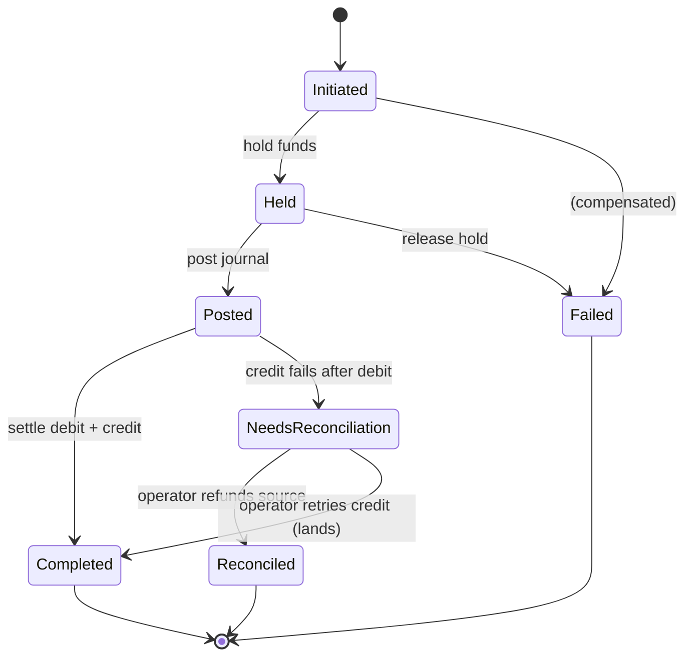
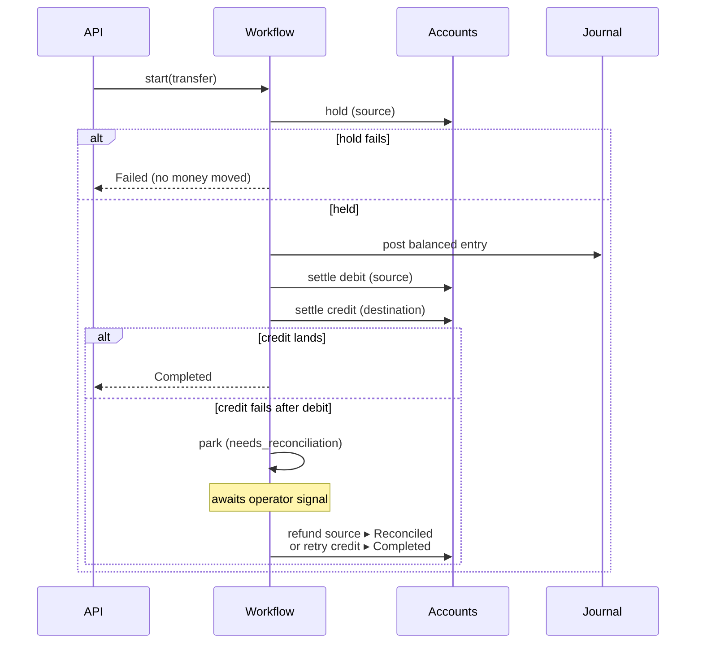

# ledger-core (Python + Temporal)

An event-sourced, double-entry payment ledger whose money-moving lifecycle is
orchestrated with [Temporal](https://temporal.io/). A Python 3.14 rewrite of the
PHP/Symfony `ledger-core`, re-architected around durable execution.

The shape of the problem — long-running, failure-prone operations across several
systems, with partial failures, compensation, reconciliation, and a hard audit
trail — is the same shape as network-service orchestration (L2/L3 VPN
provisioning). Only the domain nouns differ.

## Architectural spine

Two ownership boundaries, deliberately kept separate:

| Concern | Owner | Why |
| --- | --- | --- |
| **Process** — the transfer lifecycle (hold → post → settle, retries, compensation) | **Temporal workflow** | Durable execution: survives crashes, retries activities, makes stuck sagas *visible* instead of lost. |
| **State** — the truth about money (account balances, the double-entry journal) | **Event store (Postgres)** | Append-only log with optimistic concurrency is the system of record; balances are projections. |

Temporal *executes* the saga; the event log *narrates* it. Activities still
append transfer domain events (`TransferInitiated/Held/Posted/Completed/Failed`)
to the event store — not for durability (Temporal owns that) but for the audit
trail, read models, and the showcase event-flow view.



See [`docs/adr/`](docs/adr/) for the decisions behind this.

## Domain

Three bounded contexts (mirrors the PHP original):

- **Accounts** — aggregate with `available` + `reserved` balances (minor units).
  Invariants: operate only while `Open`; positive amounts; currency match;
  non-negative available; `reserved ∈ [0, total]`. *Event-sourced.*
- **Ledger** — double-entry journal. A balanced set of debit/credit legs posts
  atomically; rejects unknown/closed/frozen/currency-mismatched accounts.
  *Event-sourced.*
- **Transfers** — the saga. State machine `Initiated → Held → Posted →
  Completed`, `Failed` from any non-terminal state. *Temporal-owned* process,
  projected into the event store for audit/read.

### Transfer saga lifecycle

1. **Hold** funds on the source account (compensation registered: release hold).
2. **Post** a balanced double-entry journal (debit source / credit dest). On
   failure → release hold → fail.
3. **Settle**: debit source (retried on optimistic-concurrency conflict), then
   credit dest. Once the debit applies the hold is gone, so a residual credit
   failure is **not** silently compensated — the workflow parks in a
   `needs_reconciliation` state, loudly visible in the Temporal UI, and **waits
   for an operator decision** (refund the source, or retry the credit) rather than
   recording a false `failed` after money moved.



The happy path and the two failure branches, as a sequence:



## Stack

- **Python 3.14** — PEP 695 generics, PEP 649 deferred annotations, PEP 750
  t-strings, `uuid.uuid7()` from stdlib, `StrEnum`, structural pattern matching,
  `TaskGroup`/`except*`.
- **Temporal** (`temporalio`) — workflows + activities, pydantic data converter.
- **FastAPI** + **uvicorn** — HTTP surface, RFC7807 problem details.
- **asyncpg** — event store + projections (raw SQL, no ORM).
- **OpenTelemetry** + **structlog** — traces, metrics, structured logs.
- **uv** (pkg/lock/interpreter), **ruff** (lint+format), **pyright** (strict),
  **pytest** + **hypothesis** + **testcontainers** + Temporal time-skipping env.

## Layout

```
src/ledger/
  domain/{shared,accounts,ledger,transfers}   # pure domain: aggregates, events, invariants
  eventstore/                                  # Postgres append-only store, serialization, upcasters
  projections/                                 # read models + checkpoint runner
  idempotency/                                 # HTTP-level Idempotency-Key
  outbox/                                      # LISTEN/NOTIFY relay for external consumers
  temporal/{workflows,activities}              # saga orchestration + side-effect boundary
  api/                                         # FastAPI routers, auth, problem details
  ops/  observability/  showcase/  config/
migrations/   tests/{unit,integration}   deploy/   docs/adr/
```

## Quickstart

```bash
uv sync --extra dev          # or: just sync
cp .env.example .env
just up                      # Postgres + Temporal + OTel + Grafana
just migrate                 # apply DB schema
just worker                  # Temporal worker (workflows + activities)
just api                     # FastAPI on :8000
uv run ledger-relay          # outbox relay (tails the log → pg_notify)
just check                   # lint + typecheck + tests
```

Or run the whole system in containers (image + services):

```bash
docker compose --profile app up --build   # postgres + temporal + api + worker + relay
```

- Playground (saga cockpit): http://localhost:8000 — open source + dest, start a
  transfer, watch it move through the lifecycle rail and event timeline; freeze the
  destination to force the parked path, then resolve it.
- Temporal UI: http://localhost:8233
- Grafana: http://localhost:3001

## HTTP API

| Method & path | Purpose |
| --- | --- |
| `POST /api/accounts` | Open an account |
| `POST /api/accounts/{id}/deposit` | Deposit (honors `Idempotency-Key`) |
| `GET /api/accounts/{id}/balance` | Balance from the projection read model |
| `GET /api/accounts/{id}/statement` | Statement from the projection read model |
| `POST /api/accounts/{id}/freeze` · `/close` | Account lifecycle |
| `POST /api/transfers` | Start a transfer saga (honors `Idempotency-Key`) |
| `GET /api/transfers/{id}` · `/events` | Transfer status / audit stream |
| `POST /api/transfers/{id}/resolve` | Resolve a parked transfer (refund / retry) |
| `GET /healthz` · `/readyz` | Liveness / readiness |

Errors are RFC 7807 `application/problem+json`; optimistic-concurrency conflicts
surface as `409`.

## Known trade-offs

Decisions taken on purpose, owned here rather than left for a reviewer to find:

- **Gap-safe log tailing via an append lock.** `global_position` is a Postgres
  IDENTITY assigned at insert but visible at commit, so under concurrent writers a
  lower position can appear *after* a higher one is consumed — silently skipping an
  event. Appends take a transaction-scoped advisory lock so position order equals
  commit order; cursor tailers never skip. The cost is serialized appends
  (acceptable for the money system-of-record); the throughput alternative
  (xmin/xact-id visibility horizon) is the documented next step.
- **Projections are in-memory, rebuilt from the log.** The read side catches up on
  read (read-your-writes) and rebuilds from position 0 each start — self-healing,
  single-instance. A durable, cross-instance Postgres read model is the production
  evolution.
- **Idempotency store is pluggable.** In-memory for tests/single-process; a durable
  Postgres store (atomic `INSERT … ON CONFLICT`) for shared, multi-worker
  deployments, selected by config.
- **Parked transfers await an operator.** A residual credit failure never fakes a
  `failed`; the saga stays alive in `needs_reconciliation` until refunded or
  retried (ADR-0003). Auto-resolution policies can layer on top.
